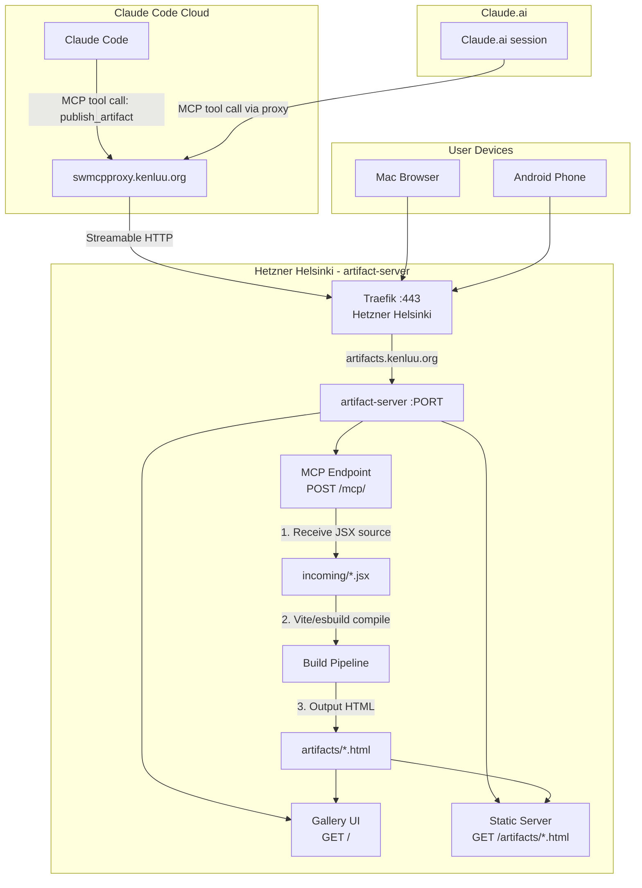

# Architecture

*Mapped: 2026-03-29*

## Project Structure Overview

| Directory | Purpose |
|-----------|--------|
| `src/` | Server source code (Node.js/Express or Fastify) |
| `src/mcp/` | MCP endpoint handler (Streamable HTTP transport) |
| `src/build/` | Vite/esbuild compilation pipeline (JSX → HTML) |
| `src/gallery/` | Gallery index page (list, delete, metadata) |
| `artifacts/` | Built HTML output directory (served statically) |
| `incoming/` | Raw JSX source files (pre-build staging) |
| `templates/` | HTML wrapper template with React + lib CDN refs |
| `Dockerfile` | Container definition |
| `docker-compose.yaml` | Hetzner deployment config |
| `gsd-lite/` | Agent protocol and session state |

## Tech Stack

- **Runtime:** Node.js 20+ (Alpine Docker image for minimal footprint)
- **Build tool:** Vite or esbuild (compiles JSX → self-contained HTML)
- **Pre-bundled libraries:** React 18, ReactDOM, Tailwind CSS, Recharts, Lucide-React, D3, Three.js, shadcn/ui, Papaparse, Chart.js, Tone.js, mathjs, lodash
- **Server:** Express or Fastify (serves MCP endpoint + static files + gallery)
- **MCP transport:** Streamable HTTP (POST endpoint, same protocol mcpproxy-go speaks)
- **Container:** Docker with `node:20-alpine` base
- **Reverse proxy:** Traefik on Hetzner (TLS termination, route `artifacts.kenluu.org`)

## Data Flow



## MCP Tool Schema (Proposed)

### `publish_artifact`

**Purpose:** Accept JSX/TSX source code, compile to HTML, serve at URL.

```json
{
  "name": "publish_artifact",
  "description": "Compile a React/JSX artifact to self-contained HTML and serve it at a public URL",
  "inputSchema": {
    "type": "object",
    "required": ["source", "title"],
    "properties": {
      "source": {
        "type": "string",
        "description": "Complete JSX/TSX source code for the React component"
      },
      "title": {
        "type": "string",
        "description": "Human-readable title for the artifact"
      },
      "description": {
        "type": "string",
        "description": "Optional description shown in gallery"
      }
    }
  }
}
```

**Returns:**
```json
{
  "url": "https://artifacts.kenluu.org/2026-03-29-network-layers.html",
  "title": "Network Layers",
  "size_kb": 412,
  "created": "2026-03-29T15:30:00Z"
}
```

### `list_artifacts`

**Purpose:** List all published artifacts with metadata.

### `delete_artifact`

**Purpose:** Remove a specific artifact by ID/filename.

## Build Pipeline Detail

The core mechanism that bridges JSX → browser:

```
Input:  component.jsx (React component source, ~100-500 lines)
            ↓
    Vite/esbuild compiler
            ↓
    1. Parse JSX syntax → plain JavaScript
    2. Bundle React runtime (~140KB minified)
    3. Bundle only used Tailwind CSS classes
    4. Tree-shake unused library code
    5. Inline everything into single HTML file
            ↓
Output: component.html (self-contained, ~200-800KB)
        ├── <script> — React + ReactDOM runtime
        ├── <script> — Component compiled to plain JS
        ├── <style>  — Tailwind CSS (used classes only)
        └── <div id="root"> — React mount point
```

Alternative approach (lighter): Instead of running Vite per-artifact, use an HTML template that loads React + libs from CDN and compiles JSX client-side via Babel standalone. Tradeoff: larger page load but zero server-side build tooling.

## Entry Points

- `docker-compose.yaml` — Hetzner deployment definition
- `src/index.js` — Server entry (Express/Fastify)
- `src/mcp/handler.js` — MCP endpoint logic
- `src/build/compile.js` — JSX → HTML build pipeline
- `src/gallery/index.html` — Gallery UI template

## Conventions

- **Artifact naming:** `YYYY-MM-DD-<slug>.html` (date-prefixed for natural sort)
- **No database:** Filesystem is the source of truth. `ls artifacts/` = full inventory.
- **API key:** MCP write endpoints require `?apikey=<key>` (same pattern as mcpproxy)
- **Container restart:** `restart: unless-stopped`
- **Traefik labels:** Standard Hetzner Traefik routing pattern

---
*Update when: tech stack decisions change, new MCP tools added, deployment topology changes*