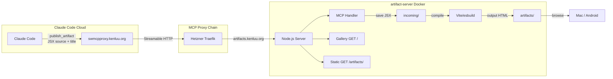

# Work Log

## 1. Current Understanding

<current_mode>
handoff
</current_mode>

<active_task>
None — research complete, ready for implementation planning
</active_task>

<parked_tasks>
- Decide: Vite server-side build vs CDN + Babel-standalone client-side compilation (tradeoff: build complexity vs page load size)
- Decide: Gallery UI framework (plain HTML vs lightweight React app)
- DNS: Create `artifacts.kenluu.org` Cloudflare record pointing to Hetzner
- MCP proxy: Add artifact-server as upstream in mcpproxy-go wrapper config
</parked_tasks>

<vision>
A self-hosted Docker artifact server on Hetzner that mirrors Claude.ai's JSX rendering capability. Claude Code cloud sessions (or any MCP client) call `publish_artifact` with raw JSX source → server compiles to self-contained HTML → serves at browsable URL → gallery for management. No local machine, no manual build steps.
</vision>

<decisions>
1. **Docker on Hetzner Helsinki** — Existing infra, Traefik already running, coexists with other services. Not on GCP (memory-constrained 2GB VM dedicated to MCP proxy).
2. **MCP Streamable HTTP transport** — Same protocol mcpproxy-go speaks. No WebSocket or SSE needed for this use case (request/response pattern).
3. **Filesystem as database** — No SQLite/Postgres. `ls artifacts/` = inventory. YYYY-MM-DD-slug.html naming for natural sort.
4. **Public viewing, authenticated writing** — Anyone with URL can view artifacts. MCP write endpoint requires API key.
5. **Pre-bundle Claude.ai's library set** — React, Tailwind, Recharts, Lucide, D3, Three.js, shadcn/ui, etc. so artifacts built here match what works in Claude.ai.
</decisions>

<blockers>
None
</blockers>

<next_action>
1. Claude Code reads these specs, validates design decisions
2. Break down implementation into tasks (TASK-001, TASK-002, etc.)
3. Start with minimal viable: MCP endpoint + build pipeline + static serve (no gallery yet)
</next_action>

---

## 2. Key Events

| Log ID | Type | Summary |
|--------|------|---------|
| LOG-001 | RESEARCH | How Claude.ai renders JSX — the mechanism behind native artifact preview |
| LOG-002 | RESEARCH | Existing solutions landscape — GitHub, Google Grounding, Reddit search via MCP proxy |
| LOG-003 | VISION | Project inception — from learning networking to designing artifact-server |

---

## 3. Atomic Session Log

### [LOG-001] - [RESEARCH] - How Claude.ai renders JSX artifacts
**Timestamp:** 2026-03-29
**Depends On:** None (first entry)

---

#### 1. Question

What is the mechanism behind Claude.ai's native artifact rendering? When I see an interactive React component in the chat panel, what's actually happening?

#### 2. Findings

Claude.ai has a **built-in mini React runtime** baked into its chat frontend. The rendering pipeline:

1. Agent writes a `.jsx` file to `/mnt/user-data/outputs/`
2. Claude.ai frontend detects the file extension
3. Frontend **compiles JSX on-the-fly** (JSX → plain JavaScript) using an embedded compiler
4. Frontend loads **pre-bundled libraries**: React 18, ReactDOM, Tailwind CSS (core utilities only — no compiler), Recharts, Lucide-React, D3, Three.js (r128), shadcn/ui, Papaparse, SheetJS, Chart.js, Tone.js, mathjs, lodash, mammoth, tensorflow
5. Component renders inside a **sandboxed iframe** in the chat panel

**Key constraints of Claude.ai's runtime:**
- No `localStorage` or `sessionStorage` (except via `window.storage` persistent API)
- No external API calls from artifacts (sandboxed)
- Single-file components only (HTML/CSS/JS combined)
- React components must have no required props or provide defaults
- Must use default export
- Tailwind limited to pre-defined utility classes (no compiler)

#### 3. Why raw JSX can't run in a browser

A `.jsx` file served by a plain web server (nginx, python -m http.server) shows **raw source code** because:
- Browsers don't understand JSX syntax (it's not standard JavaScript)
- No React runtime is loaded to execute the component
- No Tailwind CSS to handle utility classes
- No compiler to transform `<div className="flex">` → `React.createElement("div", {className: "flex"})`

#### 4. The build step bridge

The tool `claude-artifact-runner` (`npx run-claude-artifact build file.jsx`) solves this by:

```
Input:  component.jsx (~100-500 lines of JSX)
            ↓
    Vite + esbuild compiler
            ↓
Output: component.html (single self-contained file, ~200-800KB)
        ├── <script> — React + ReactDOM runtime (~140KB minified)
        ├── <script> — Component compiled to plain JavaScript
        ├── <style>  — Tailwind CSS (only classes used)
        └── <div id="root"> — React mount point
```

The output HTML is **completely self-contained**. Any dumb file server can host it. No Node.js, no npm, no build tools needed on the serving end.

#### 5. Reference artifacts from this session

Two interactive JSX artifacts were built during this teaching session:
- `network-layers.jsx` — Interactive protocol explainer (IP, TCP, HTTP, HTTPS, SSE, WebSocket, STDIO) with tabbed navigation, sequence diagrams, comparison table, and full tool-call flow visualization. All examples use the user's actual GCP proxy infrastructure.
- `stdio-deep-dive.jsx` — Deep dive into Unix STDIO (1971 origins, stdin/stdout/stderr, pipe operator, process isolation, bidirectionality, MCP usage) with process box diagrams, pipe chain visualization, and isolation comparison.

Both rendered perfectly in Claude.ai's built-in runtime. These are the artifacts that motivated this project — how to produce and view similar content from Claude Code.

---

📦 STATELESS HANDOFF
**What was found:** Claude.ai's artifact rendering is a frontend feature — embedded React compiler + pre-bundled libs + sandboxed iframe. The build step (JSX → HTML) is the bridge to making artifacts portable. `claude-artifact-runner` already solves the build but is CLI-only, not a server.
**Next action:** Research existing solutions that combine build + serve + MCP (LOG-002).

### [LOG-002] - [RESEARCH] - Existing solutions landscape
**Timestamp:** 2026-03-29
**Depends On:** LOG-001 (understanding the JSX rendering mechanism)

---

#### 1. Question

Has anyone already built a self-hosted artifact rendering server with MCP integration? What existing tools can we leverage?

#### 2. Search methodology

Searched via three channels through MCP proxy (`swmcpproxy.kenluu.org`):
- **GitHub** (`utils:github__search_repositories`) — queries: "claude artifact renderer server react JSX self-hosted", "artifact runner react renderer server docker"
- **Google Grounding** (`utils:google-grounding__search_with_grounding`) — query: "self-hosted React JSX artifact renderer server Docker Claude Code MCP endpoint"
- **Reddit** (`utils:google-grounding__search_reddit`) — subreddit: r/ClaudeAI, query: "self-hosted Claude artifact renderer server React JSX preview Docker MCP"
- **Web search** (Claude.ai native) — queries: "Claude Code HTML artifact server", "claude-artifact-runner npx build HTML self-hosted"

#### 3. Solutions found

| Solution | What it does | MCP? | Server? | Build? | Gallery? | Status |
|----------|-------------|------|---------|--------|----------|--------|
| `claude-artifact-runner` (claudio-silva) | CLI: JSX → HTML build, dev server, Docker image | No | Dev only | Yes | No | Most mature, active |
| `LLM-React-Artifact-Render-Server` (aziddy) | Self-hosted paste-based React renderer with iframe preview | No | Yes | Partial | Basic | 0 stars, Feb 2026 |
| `claude-artifact-viewer-template` (sbusso) | Gallery with auto-nav for artifacts in `src/artifacts/` folder | No | Yes | No | Yes | Template, Cloudflare Pages |
| Claude Code Desktop preview MCP | Built-in `preview_start` + `launch.json`, headless browser | Yes | Local | N/A | No | Official, local/SSH only |
| HolyClaude | Dockerized Claude Code with web UI + headless Chromium | No | Yes | N/A | No | Reddit project, Mar 2026 |
| Simon Willison's approach | `python -m http.server` or GitHub Pages for built HTML | No | Minimal | Manual | No | Blog posts, proven |
| johnowhitaker | FastHTML site on $5 Linode serving built artifacts | No | Yes | Manual | Basic | Blog post, $5/mo |

#### 4. Gap analysis

**What exists:** The build step (JSX → HTML) is solved by `claude-artifact-runner`. Static serving is trivial (nginx, python). Gallery viewers exist but are template-based.

**What's missing:** Nobody has combined all four pieces into one deployable unit:
1. MCP endpoint (accept JSX via tool call)
2. Build pipeline (compile JSX → self-contained HTML)
3. Static file server (serve built artifacts at URLs)
4. Gallery (browse, manage, delete artifacts)

**The specific gap:** Claude Code cloud sessions have no native server access. They can't run `npx run-claude-artifact build` because there's no persistent filesystem. They can't open a browser. The MCP endpoint is the critical missing piece — it lets Claude Code push source code to a remote server that handles everything.

#### 5. Key technical insight from research

Google Grounding surfaced an alternative to server-side Vite builds: **client-side compilation using Babel standalone**. Instead of running Vite per-artifact, the server wraps JSX source in an HTML template that loads React + Babel from CDN and compiles in the browser. Tradeoff:
- **Server-side (Vite):** Smaller output, faster load, requires Node.js build tooling in container
- **Client-side (Babel):** Larger page load (~1MB Babel), slower initial render, but zero build infrastructure needed

This is a decision to make during implementation.

---

📦 STATELESS HANDOFF
**What was found:** No existing solution combines MCP + build + serve + gallery. The build step is solved (`claude-artifact-runner`). The gap is the MCP endpoint and the wiring. Two build approaches available (server-side Vite vs client-side Babel).
**Next action:** Define project vision and architecture (LOG-003), then hand off to Claude Code for implementation.

### [LOG-003] - [VISION] - Project inception — from learning networking to designing artifact-server
**Timestamp:** 2026-03-29
**Depends On:** LOG-001 (JSX mechanism), LOG-002 (existing solutions)

---

#### 1. Narrative arc

This project emerged organically from a teaching session, not from a planned feature request.

**Phase 1 — Learning the web stack:**
User (Kha) asked to understand how the web works in the context of their MCP proxy infrastructure. Starting from ping (the only concept they felt confident about), we built up layer by layer: IP → TCP → HTTP → HTTPS/TLS → SSE → WebSocket → STDIO. Every concept was grounded in their actual infrastructure — Traefik on GCP Singapore, mcpproxy-go Streamable HTTP to pi/thinkpad, SSE to crawl4ai on Hetzner, STDIO pipes to fs-mcp.

**Phase 2 — Interactive artifacts:**
To help visualize these concepts, two React artifacts were built:
- `network-layers.jsx` — Tabbed protocol explainer with sequence diagrams, comparison table, full Claude.ai tool-call flow path. Used the user's real hostnames, IPs, ports, and Docker network gateway addresses.
- `stdio-deep-dive.jsx` — Six-section deep dive from Unix 1971 origins through process isolation to MCP's usage of STDIO. Included process box diagrams, pipe chain visualization, bidirectional pipe diagrams, and the full gce_at_slash MCP flow.

Both rendered beautifully in Claude.ai's native React runtime.

**Phase 3 — The gap revelation:**
User asked: "I want to do something like this for Claude Code." This surfaced the core problem: Claude Code cloud sessions have no native way to render or preview React artifacts. They can write `.jsx` files but can't compile or view them. The user's exact framing: wanting to build something so Claude Code could produce interactive HTML they could consume, with Hetzner as the hosting backend.

**Phase 4 — Research:**
Searched GitHub, Google Grounding, Reddit via MCP proxy. Found partial solutions but no complete package. The key insight: the build step is solved (`claude-artifact-runner`), but nobody has wired it to an MCP endpoint for programmatic artifact publishing.

**Phase 5 — Design:**
User proposed: "How about we mirror Claude.ai's frontend setup by building a server that can render React, deploy as Docker, expose MCP endpoints so you can write files directly." This became the artifact-server design.

#### 2. Architecture diagram



#### 3. User's vision statement

> "I love how Claude.ai native chat app has JSX rendering out of the box. I want to build something for Claude Code — maybe a tool that Claude Code can use to create HTML I can consume. The core limitation of Claude Code cloud sessions is there's really no host to serve these. But I'm open to setting up my Hetzner to store and serve these artifacts as long as it's manageable — I can clean up, navigate, and consume content."

#### 4. Design decisions from this session

| Decision | Rationale | Alternatives rejected |
|----------|-----------|----------------------|
| Docker on Hetzner | Existing infra, 8GB RAM, Traefik ready | GCP Singapore (only 2GB, dedicated to MCP proxy) |
| MCP Streamable HTTP | Same protocol mcpproxy-go uses, zero idle traffic | WebSocket (overkill), SSE (wrong direction) |
| Single container | Simple, manageable, one `docker-compose up` | Multi-container (unnecessary complexity) |
| Filesystem storage | `ls` = inventory, no DB to manage | SQLite (overhead for simple file listing) |
| Pre-bundle Claude.ai libs | Artifacts built here should match Claude.ai compatibility | CDN-only (slower, dependency on external CDN availability) |
| API key auth for writes | Same pattern as mcpproxy (`?apikey=`) | OAuth (overkill for single-user) |

#### 5. Networking context (from teaching session)

The user now understands the full protocol stack their infrastructure uses:
- **Streamable HTTP** (pi, thinkpad, github upstreams) — request/response, zero idle traffic
- **SSE** (webfetch_to_md to Hetzner crawl4ai) — persistent one-way stream, ~280 KB/day keepalives
- **STDIO** (gce_at_slash, google-grounding) — kernel pipes, not network, zero egress
- **HTTPS/TLS** — Traefik terminates, internal Docker traffic is plain HTTP
- **WebSocket** — not currently used in their stack (mcpproxy-go v0.22.0 uses Streamable HTTP)

The artifact-server will use **Streamable HTTP** for MCP (same as other upstreams), routed through the existing proxy chain. This means zero idle traffic when no artifacts are being published.

---

📦 STATELESS HANDOFF
**Dependency chain:** LOG-003 ← LOG-002 (research) ← LOG-001 (mechanism)
**What was decided:** Build a self-hosted Docker artifact server on Hetzner with MCP endpoint, Vite build pipeline, static server, and gallery. Name: `artifact-server`. Domain: `artifacts.kenluu.org`.
**Current state:** PROJECT.md, ARCHITECTURE.md, WORK.md written with full research and design. Agent instructions (`gsd-lite.md`) scaffolded. Ready for implementation.
**Next action:** Claude Code reads specs, validates design, breaks into implementation tasks (Docker setup, MCP endpoint, build pipeline, static server, gallery, Traefik route, mcpproxy-go upstream config).
**If pivoting:** All research is in LOG-001 and LOG-002. Key tools: `claude-artifact-runner` for build reference, `aziddy/LLM-React-Artifact-Render-Server` for server reference. Two build approaches documented (server-side Vite vs client-side Babel standalone).